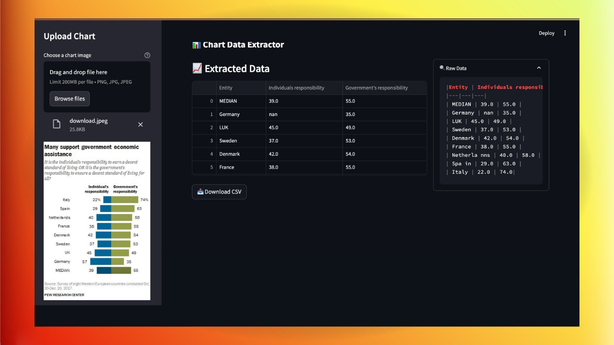

# Google DePlot - Chart Data Extractor

A streamlined web app that instantly converts chart images into downloadable CSV data using Google Deplot using Nvidia NIMS Inferencing.

[](https://github.com/lesteroliver911/google-deplot-streamlit/blob/main/LICENSE)

## Features

* **Image Upload**: Upload chart images up to 180KB in PNG, JPG, or JPEG format
* **Data Extraction**: Utilizes Google's DePlot model to convert chart images into data tables
* **Data Preview**: View extracted data directly within the app
* **CSV Download**: Download the extracted data as a CSV file for further analysis

## Screenshot



## Getting Started

### Prerequisites

- Python 3.8 or higher
- NVIDIA API key for accessing the Google De-Plot model

### Installation

1. Clone the repository:
```bash
git clone https://github.com/lesteroliver911/google-deplot-streamlit.git
cd google-deplot-streamlit
```

2. Install required packages:
```bash
pip install -r requirements.txt
```

3. Create a `.env` file in the root directory and add your NVIDIA API key:
```bash
NVIDIA_API_KEY=your_api_key_here
```

### Running Locally

Start the Streamlit app:
```bash
streamlit run app.py
```

The app will open in your default web browser at `http://localhost:8501`.

## Usage

1. Upload a chart image using the file uploader in the sidebar
2. Click the "Extract Data" button to process the image
3. Preview the extracted data in the table view
4. Download the data as a CSV file using the "Download CSV" button

## Technology Stack

- [Streamlit](https://streamlit.io/) - Web application framework
- [Google DePlot](https://ai.google/research/pubs/pub51615/) - Chart data extraction model
- [NVIDIA API](https://developer.nvidia.com/) - DePlot model deployment
- [Pandas](https://pandas.pydata.org/) - Data manipulation and analysis

## Contributing

Contributions are welcome! Please feel free to submit a Pull Request.

1. Fork the repository
2. Create your feature branch (`git checkout -b feature/AmazingFeature`)
3. Commit your changes (`git commit -m 'Add some AmazingFeature'`)
4. Push to the branch (`git push origin feature/AmazingFeature`)
5. Open a Pull Request

## License

This project is licensed under the MIT License - see the [LICENSE](LICENSE) file for details.

## Acknowledgments

- Google Research for the DePlot model
- NVIDIA for providing the API infrastructure
- Streamlit for the excellent web app framework
